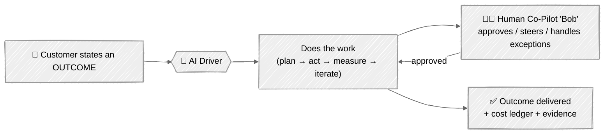
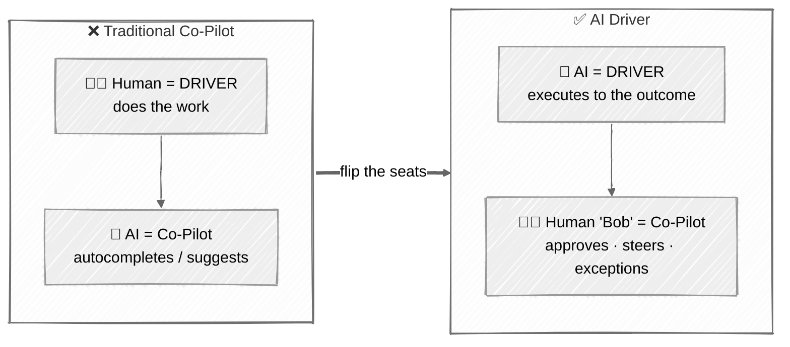
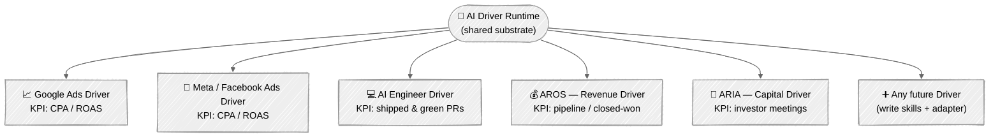
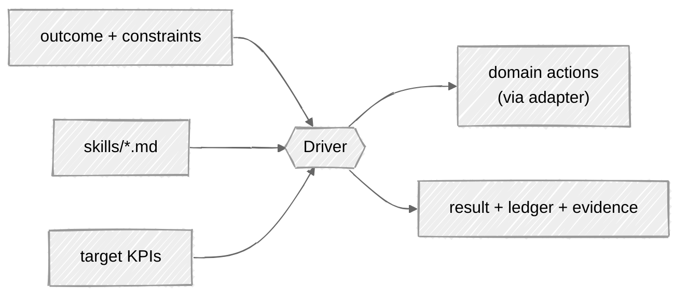
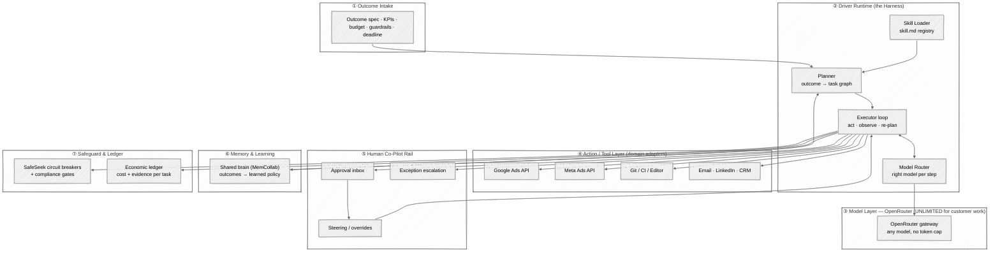
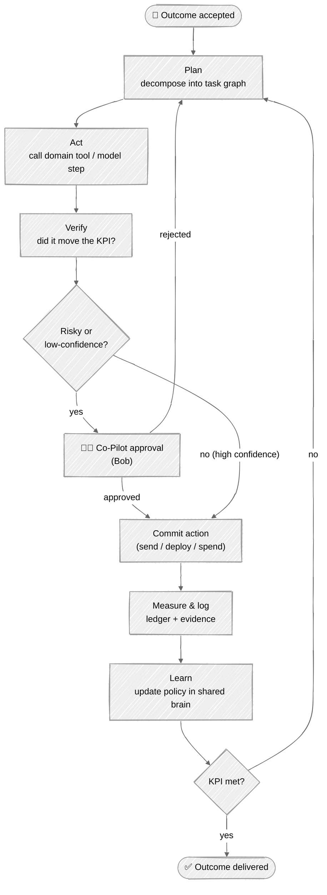
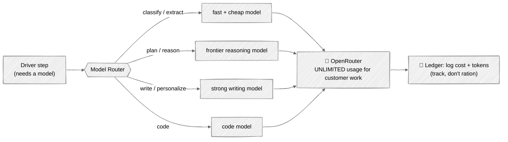
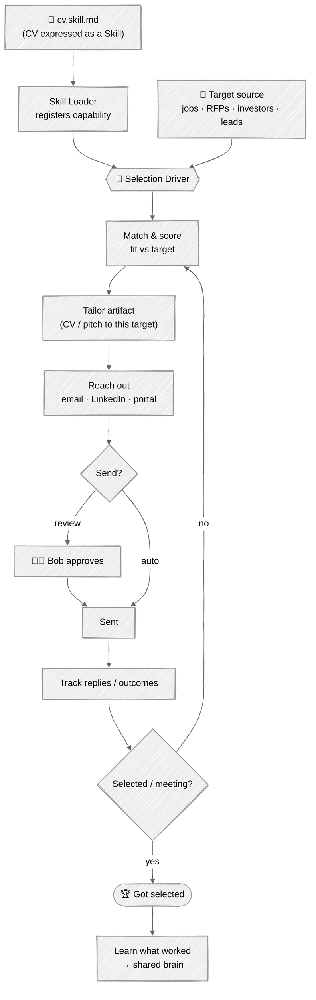
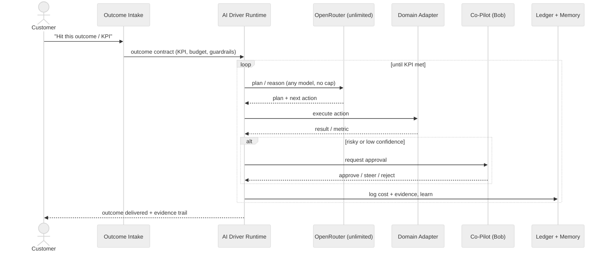

# AI Driver Platform — Architecture

> **The inversion:** *You tell us the outcome. The **AI is the Driver** — it does the work.
> A human ("Bob") is the **Co-Pilot** — approves, steers, and handles exceptions.*
>
> This is the single source-of-truth architecture file. Every diagram below is written in
> **Mermaid** with the **hand-drawn (Excalidraw-style)** look. It renders on GitHub as-is,
> and can be exported to a real Excalidraw canvas (see [§9](#9-render--export-to-excalidraw)).

> **Companion matrix:** [`tools-matrix.md`](./tools-matrix.md) maps **153 business tools** by price band, category, and outcome, then shows how the Orchestrator chooses tools for local business, AI SDR, Meta/Google ads, reputation, voice, finance, ops, and forecasting.

---

## Table of Contents
1. [The One-Line Thesis](#1-the-one-line-thesis)
2. [The Inversion: Driver vs Co-Pilot](#2-the-inversion-driver-vs-co-pilot)
3. [Product Family — The Drivers](#3-product-family--the-drivers)
4. [Platform Architecture (Layers)](#4-platform-architecture-layers)
5. [The Driver Execution Loop](#5-the-driver-execution-loop)
6. [Model Layer — Unlimited OpenRouter](#6-model-layer--unlimited-openrouter)
7. [CV-as-a-Skill (`skill.md`) → "Get Selected" Automation](#7-cv-as-a-skill-skillmd--get-selected-automation)
8. [End-to-End Sequence (one outcome)](#8-end-to-end-sequence-one-outcome)
9. [Render / Export to Excalidraw](#9-render--export-to-excalidraw)
10. [Component Glossary](#10-component-glossary)

---

## 1. The One-Line Thesis

**An AI Driver is an outcome-taking machine.** The customer states a *result* ("lower my Google Ads
CPA to $40", "ship this feature", "book 10 investor meetings"). The Driver plans, acts, measures,
and iterates **unattended** — pulling any model it needs from OpenRouter with **no token budget for
customer work** — while a human Co-Pilot sits on an approval/steering rail.

---

## 2. The Inversion: Driver vs Co-Pilot

Traditional "AI co-pilots" keep the human in the driver's seat doing the work. **We flip it.**

| | Traditional Co-Pilot | **AI Driver (this platform)** |
|---|---|---|
| Who does the work | Human | **AI** |
| Who supervises | AI suggests | **Human ("Bob") approves & steers** |
| Unit of instruction | Task / keystroke | **Outcome / KPI** |
| Default mode | Human-triggered | **Unattended, always-on** |
| Human touch points | Constant | **Exception + approval gates only** |
| Accountability | Human | **Per-task economic ledger on the Driver** |

---

## 3. Product Family — The Drivers

One substrate, many Drivers. Each Driver = **domain adapter + skills + KPIs** plugged into the
shared runtime. New Drivers are added by writing skills and wiring a domain tool adapter — the
engine, model layer, memory, safeguard, and co-pilot rail are reused.

**Driver contract (every Driver implements the same interface):**

---

## 4. Platform Architecture (Layers)

**Reading the layers**
- **① Intake** turns a human wish into a machine-checkable **outcome contract** (KPI, budget, guardrails, deadline).
- **② Runtime** is the Driver brain: plan → execute → re-plan, loading **skills** and routing each step to a model.
- **③ Model layer** is OpenRouter with an **unlimited-usage policy for all customer-related work** — the Driver never rations tokens on a customer's behalf.
- **④ Action layer** are thin adapters; each Driver only needs its own.
- **⑤ Co-Pilot rail** is where "Bob" lives — approvals, steering, escalation. The AI drives; the human governs.
- **⑥ Memory** makes every Driver smarter from every outcome (shared, cross-Driver).
- **⑦ Safeguard + ledger** guarantee nothing unverified ships, and every action has a cost + evidence trail.

---

## 5. The Driver Execution Loop

The heartbeat of every Driver — the same loop whether it's tuning ad bids or shipping code.

**Key rule:** confidence + risk decide whether the human is pulled in. High-confidence, low-risk
actions run unattended; anything spending real money, sending to a real person, or shipping to prod
crosses the **Co-Pilot gate** first.

---

## 6. Model Layer — Unlimited OpenRouter

Every customer-facing Driver has **no token budget**: it may call *any* model on OpenRouter as many
times as the outcome requires. Cost is tracked (ledger) but never rationed for customer work. A
router picks the right model per step — cheap-fast for classification, deep-reasoning for planning.

**Policy in one sentence:** *unlimited tokens, any model, for all customer-related work — on every
AI Driver — with full cost transparency but no customer-facing throttling.*

---

## 7. CV-as-a-Skill (`skill.md`) → "Get Selected" Automation

The CV is not a static PDF — it's a **`skill.md`**: a portable capability file the Driver loads. That
turns "getting hired / selected / funded" into an **outcome the Driver can drive**. Connect the CV
skill to a target source (jobs, RFPs, investors) and the Driver runs the same loop until it books the
meeting or lands the selection.

**Why this matters:** the same machinery that runs ads and ships code also **markets its own
operator** — the CV skill lets an AI Driver autonomously pursue "get selected" as a measurable KPI
(applications sent, replies, meetings, offers), with Bob approving anything that leaves the building.

---

## 8. End-to-End Sequence (one outcome)

A single outcome, start to finish, showing where the human enters.

---

## 9. Render / Export to Excalidraw

- **On GitHub / any Mermaid viewer:** diagrams render directly; the `look: handDrawn` directive gives
  the Excalidraw sketch aesthetic with zero extra tooling.
- **To a real Excalidraw canvas:**
  1. Open [https://mermaid.live](https://mermaid.live), paste any diagram block.
  2. In Excalidraw, use **Insert → Mermaid to Excalidraw**, paste the same code → fully editable shapes.
- **Keep it one file:** this document is the *single* architecture artifact by design. Diagrams live
  inline as code so they stay version-controlled and diffable — no binary image drift.

---

## 10. Component Glossary

| Component | Role |
|---|---|
| **AI Driver** | Outcome-taking agent that does the work unattended. |
| **Co-Pilot ("Bob")** | Human on the approval/steering/exception rail. |
| **Outcome Contract** | Machine-checkable KPI + budget + guardrails + deadline. |
| **Driver Runtime / Harness** | Plan → act → verify → learn engine shared by all Drivers. |
| **Model Router** | Picks the right model per step. |
| **OpenRouter (unlimited)** | Model gateway; unlimited usage for all customer work. |
| **Domain Adapter** | Thin per-Driver connector (Google Ads, Meta, Git, CRM…). |
| **Co-Pilot Rail** | Approval inbox + steering + escalation surface. |
| **Shared Brain (MemCollab)** | Cross-Driver memory; every outcome improves all Drivers. |
| **SafeSeek / Safeguard** | Circuit breakers + compliance so nothing unverified ships. |
| **Economic Ledger** | Cost + evidence trail per task. |
| **`cv.skill.md`** | CV expressed as a loadable Skill for the "get selected" Driver. |

---

*Single-file architecture · Mermaid (hand-drawn / Excalidraw look) · one source of truth.*
