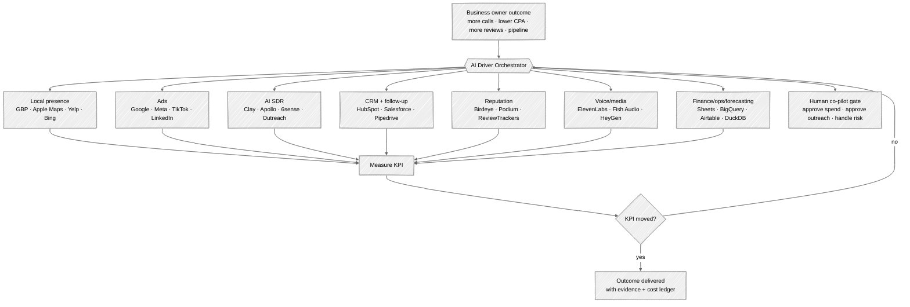
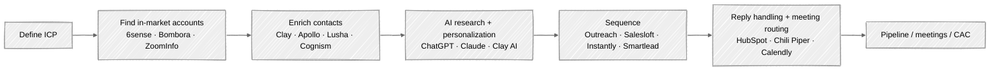
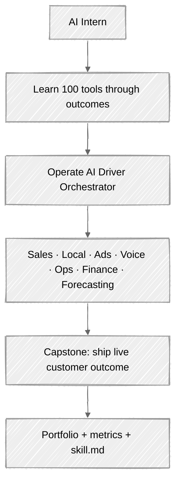

# AI Driver Orchestrator — 145 Business Tools Matrix

> **Purpose:** One orchestration system that can drive outcomes for USA business owners across local presence, Google/Meta ads, AI SDR, enrichment, CRM, reputation, voice, content, hiring and team building, landing pages, in-house AI software engineering, finance, operations, and forecasting.
>
> **Important pricing note:** this is a strategic price-band map, not a procurement quote. Enterprise SaaS pricing changes often, many vendors require custom quotes, and usage-based tools can become expensive depending on seats, credits, ad spend, locations, contacts, and API calls. Verify exact pricing before purchase.

---

## 1. The Core Idea

Business owners do not want 100 tools. They want outcomes:

- More calls
- More booked appointments
- More reviews
- More local map visibility
- Lower Google/Meta cost per lead
- More qualified pipeline
- Better follow-up
- Better forecasts
- Less manual admin

The **AI Driver Orchestrator** sits above the tool stack. It receives an outcome, chooses the right tools, executes the workflow, measures the KPI, and escalates risky actions to the human co-pilot.

---

## 2. Price Bands — Most Expensive to Most Affordable

| Band | Typical buying motion | What it means |
|---|---|---|
| **A. Enterprise / custom** | Sales call, annual contract, quote-based | Most expensive; best for multi-location, B2B, complex GTM, ABM, enterprise CRM, high spend |
| **B. Mid-market paid** | Monthly/annual SaaS, often $100s–$1,000s/mo | Best for growing SMBs, agencies, B2B teams, serious local operators |
| **C. SMB paid** | Self-serve, affordable monthly tools | Best for owner-operators and small teams |
| **D. Freemium / free foundation** | Free account; pay for ads/usage/features | Must-have base layer for every US business |

---

## 3. Band A — Enterprise / Custom Tools

| # | Tool | Category | Outcome it can drive |
|---:|---|---|---|
| 1 | **6sense** | ABM / intent | Predict which accounts are in-market, prioritize sales, trigger ads/email based on buying stage |
| 2 | **ZoomInfo** | B2B data | Build large prospect lists, enrich CRM, find contacts, intent signals, sales intelligence |
| 3 | **Demandbase** | ABM | Target named accounts, run ABM ads, personalize campaigns, measure account engagement |
| 4 | **Salesforce Sales Cloud** | CRM | Enterprise pipeline, forecasting, account management, sales activity tracking |
| 5 | **HubSpot Enterprise** | CRM / marketing / service | Full customer platform: marketing, sales, service, ops, reporting, AI agents |
| 6 | **Adobe Marketo Engage** | Marketing automation | Enterprise lead nurture, scoring, campaigns, attribution |
| 7 | **Qualified / Piper AI SDR** | AI SDR / website conversion | Turn website visitors into pipeline through AI chat, qualification, routing, human handoff |
| 8 | **Outreach** | Sales engagement | Cadences, email/call tasks, revenue workflows, rep productivity |
| 9 | **Salesloft** | Sales engagement | Sales cadences, dialer, conversation intelligence, pipeline workflows |
| 10 | **Gong** | Revenue intelligence | Analyze sales calls, coach reps, detect deal risk, improve win rates |
| 11 | **Clari** | Forecasting / RevOps | Forecast pipeline, inspect deal health, revenue governance |
| 12 | **Mutiny** | Website personalization | Personalize landing pages by account/segment; convert ABM traffic |
| 13 | **Clearbit / Breeze Intelligence** | Enrichment | Identify visitors, enrich leads/accounts, shorten forms, improve targeting |
| 14 | **Cognism** | B2B data | Verified phone/email data, compliant outbound, international prospecting |
| 15 | **Bombora** | Intent data | Know what topics companies are researching before they raise their hand |
| 16 | **Snowflake** | Data warehouse | Centralize customer, ads, CRM, finance, and operations data |
| 17 | **Google BigQuery + Vertex AI** | Data + AI | Analytics, prediction, model training, marketing/sales forecasting |
| 18 | **Tableau** | BI | Executive dashboards, pipeline reporting, marketing attribution views |
| 19 | **Microsoft Dynamics 365** | CRM / ERP | Sales/service/finance operations, enterprise workflows |
| 20 | **ServiceNow** | Operations automation | Enterprise workflow automation, IT/service operations, approvals |

**Best for:** enterprise B2B, franchise/multi-location, large sales teams, large ad budgets, venture-backed companies.

---

## 4. Band B — Mid-Market Paid Tools

| # | Tool | Category | Outcome it can drive |
|---:|---|---|---|
| 21 | **Clay** | GTM orchestration | Waterfall enrichment, AI research, list building, outbound triggers, CRM sync |
| 22 | **Apollo.io** | Sales intelligence + engagement | Find leads, enrich data, sequence emails/calls, manage prospecting |
| 23 | **Lusha** | Contact data | Find direct dials/emails, enrich prospects, speed up list building |
| 24 | **Seamless.AI** | Contact search | Real-time contact discovery and CRM export |
| 25 | **LeadIQ** | Prospecting | Capture leads from LinkedIn/web, sync to CRM, prep sales outreach |
| 26 | **Chili Piper** | Routing / scheduling | Convert inbound leads faster with instant booking and routing |
| 27 | **Calendly Enterprise** | Scheduling | Book meetings, route teams, reduce back-and-forth |
| 28 | **Instantly** | Cold email infrastructure | Send at scale, warm inboxes, manage replies, improve deliverability |
| 29 | **Smartlead** | Cold email infrastructure | Multi-inbox sending, reply management, deliverability ops |
| 30 | **Reply.io** | Sales engagement | Email/LinkedIn/call sequences and AI-assisted outreach |
| 31 | **Lemlist** | Cold outreach | Personalized outbound campaigns, email warmup, LinkedIn steps |
| 32 | **Close CRM** | Sales CRM | Inside-sales calling, emailing, pipeline, SMS |
| 33 | **Pipedrive Advanced/Professional** | CRM | Simple pipeline management and follow-up automation |
| 34 | **Monday CRM** | CRM / workflow | Visual CRM, task workflows, sales ops dashboards |
| 35 | **ActiveCampaign** | Email / automation | Email nurture, segmentation, small-business CRM automation |
| 36 | **Klaviyo** | Ecommerce marketing | Email/SMS lifecycle marketing, retention, abandoned-cart recovery |
| 37 | **Attio** | Modern CRM | Flexible CRM, relationship intelligence, GTM workflows |
| 38 | **Zapier Teams** | Automation | Connect apps, automate repetitive workflows, trigger AI actions |
| 39 | **Make Teams** | Automation | Visual workflow automation, API workflows, data routing |
| 40 | **Airtable Business** | Ops database | Lightweight internal apps, CRM, inventory, project tracking |

**Best for:** serious SMB, B2B agencies, AI SDR builders, startups, local businesses ready to systemize.

---

## 5. Band B/C — Local Growth, Reputation, and Listings

| # | Tool | Category | Outcome it can drive |
|---:|---|---|---|
| 41 | **Birdeye** | Reviews/listings/messaging | Get more reviews, sync listings, respond to messages, improve local reputation |
| 42 | **Podium** | Reviews/text/payments | Convert website visitors, request reviews, text customers, collect payments |
| 43 | **SOCi** | Multi-location marketing | Manage listings, reviews, local social, ads across many locations |
| 44 | **Uberall** | Local SEO/listings | Sync business info, manage reviews, improve map visibility |
| 45 | **Yext** | Listings/search | Push location data to directories, suppress duplicates, manage reviews |
| 46 | **ReviewTrackers** | Review management | Monitor/respond to reviews, track sentiment, compare locations |
| 47 | **BrightLocal** | Local SEO | Citation audits, local rank tracking, reputation tools |
| 48 | **Whitespark** | Citations/local SEO | Find/build citations, track local rankings, generate review links |
| 49 | **Semrush Local** | Listings/local SEO | Manage listings, track local SEO, monitor reviews |
| 50 | **MapLabs** | Google/Apple Maps automation | Manage many Google and Apple map listings, reports, edits |
| 51 | **Ordering.Tools Listings** | Directory sync | Update once and publish to Google, Apple Maps, Facebook, Instagram, Bing |
| 52 | **Zoho Publish** | Listings/reviews | Publish business info, monitor reviews, manage local presence |
| 53 | **Yelp Ads** | Local ads | Get more calls/messages from Yelp users searching local services |
| 54 | **Nextdoor Ads** | Neighborhood ads | Reach homeowners and neighborhood buyers |
| 55 | **Angi Ads** | Home-services leads | Buy intent-heavy leads for contractors/home services |
| 56 | **Thryv** | SMB business management | CRM, payments, scheduling, reviews, communications |
| 57 | **GoHighLevel** | Agency/SMB marketing OS | CRM, funnels, SMS/email, reputation, automation |
| 58 | **LocaliQ** | Local marketing agency platform | Local ads, SEO, listings, lead generation |
| 59 | **CallRail** | Call tracking | Attribute phone calls to ads/search/pages; improve spend decisions |
| 60 | **CallTrackingMetrics** | Call analytics | Call tracking, routing, attribution, conversation analytics |
| 61 | **Reputation.com** | Reputation management | Enterprise/local review management and experience scoring |
| 62 | **Sprout Social** | Social management | Schedule social, inbox, analytics, reputation workflows |
| 63 | **Buffer** | Social scheduling | Schedule social posts affordably across channels |
| 64 | **Hootsuite** | Social management | Multi-channel scheduling, monitoring, analytics |
| 65 | **Later** | Social content | Visual scheduling for Instagram/TikTok/social content |

**Best for:** restaurants, med spas, law firms, dentists, plumbers, HVAC, contractors, gyms, franchises, retail.

---

## 6. Band C — AI, Voice, Creative, Content, and Automation

| # | Tool | Category | Outcome it can drive |
|---:|---|---|---|
| 66 | **ChatGPT Business / Enterprise** | AI workspace | Research, writing, analysis, coding, custom GPTs, team AI productivity |
| 67 | **Claude Team** | AI workspace | Long-context analysis, writing, artifacts, business reasoning |
| 68 | **Gemini for Workspace** | AI workspace | Gmail/Docs/Sheets/Meet AI, business assistant inside Google stack |
| 69 | **Microsoft Copilot** | AI workspace | Office/Teams/Outlook/Excel AI productivity |
| 70 | **Perplexity Pro / Enterprise** | AI search | Cited research, market scans, competitor intelligence |
| 71 | **ElevenLabs** | Voice AI | Voice agents, text-to-speech, dubbing, voice cloning, customer calls |
| 72 | **Fish Audio** | Voice AI | Expressive real-time voice generation and voice cloning |
| 73 | **HeyGen** | Video avatar | AI video sales messages, training videos, localization |
| 74 | **Descript** | Audio/video editing | Podcast/video editing, captions, clips, voice cleanup |
| 75 | **Canva Pro** | Design | Ads, social graphics, pitch decks, brand kits, templates |
| 76 | **Runway** | AI video | Generate/edit marketing videos, product videos, social ads |
| 77 | **Midjourney** | Image generation | High-quality campaign visuals, concepts, ads, creative direction |
| 78 | **Adobe Firefly** | Creative AI | Brand-safe image generation/editing inside Adobe workflows |
| 79 | **Notion AI** | Workspace | Docs, SOPs, knowledge base, project plans, meeting notes |
| 80 | **Jasper** | Marketing copy | Brand-aligned campaign copy, blog, ads, landing pages |
| 81 | **Copy.ai** | GTM automation/copy | Sales copy, content workflows, GTM automation |
| 82 | **n8n Cloud / Self-hosted** | Automation | Build AI workflows, connect APIs, run automations without Zapier tax |
| 83 | **Relevance AI** | AI agents | Build business AI agents for workflows and internal ops |
| 84 | **Lindy** | AI assistant/agents | Email/calendar/admin/sales assistant workflows |
| 85 | **Gumloop** | AI workflow builder | Browser/API automations, lead research, internal process automation |

**Best for:** AI-first operations, content production, voice agents, marketing execution, internal workflow automation.

---

## 7. Band D — Free / Freemium Foundation Every Business Should Own

| # | Tool | Category | Outcome it can drive |
|---:|---|---|---|
| 86 | **Google Business Profile** | Local presence | Show up on Google Search/Maps, manage hours/photos/reviews/Q&A/posts |
| 87 | **Apple Business Connect** | Local presence | Manage Apple Maps place cards, logos, photos, offers, analytics |
| 88 | **Bing Places for Business** | Local presence | Appear on Bing Maps/Search with accurate business details |
| 89 | **Yelp Business Page** | Local presence | Claim listing, respond to reviews, add photos, receive leads |
| 90 | **Meta Business Suite** | Social/local | Manage Facebook/Instagram pages, inbox, posts, basic analytics |
| 91 | **Google Analytics 4** | Analytics | Track website behavior, events, conversions, attribution |
| 92 | **Google Search Console** | SEO | Track search performance, indexing, keyword visibility |
| 93 | **Google Merchant Center** | Ecommerce/local products | List products on Google surfaces; feed shopping/ads |
| 94 | **Google Ads** | Paid acquisition | Search/maps/display/youtube ads; pay to generate leads or sales |
| 95 | **Meta Ads Manager** | Paid acquisition | Facebook/Instagram ads for leads, traffic, awareness, retargeting |
| 96 | **TikTok Business Center** | Paid/social | TikTok ads, creator-style campaigns, younger audiences |
| 97 | **LinkedIn Pages + Campaign Manager** | B2B marketing | Company page, B2B ads, sponsored messages, lead forms |
| 98 | **YouTube Studio** | Video marketing | Publish videos, track views, grow search/video presence |
| 99 | **WhatsApp Business** | Messaging | Customer messaging, catalogs, local service communication |
| 100 | **Google Trends** | Market research | Identify search demand, seasonality, local interest |
| 101 | **Looker Studio** | Dashboards | Free dashboards for ads, analytics, CRM, local KPIs |
| 102 | **Zapier Free** | Automation | Lightweight app-to-app automation |
| 103 | **Make Free** | Automation | Free workflow automations and API scenarios |
| 104 | **Airtable Free** | Database | Lightweight CRM, project tracker, content calendar |
| 105 | **Notion Free** | Workspace | SOPs, wiki, project docs, operating system |

**Best for:** every US business, even before spending $1 on SaaS.

---

## 8. Band E — Hiring, Recruiting & Team Building

| # | Tool | Category | Outcome it can drive |
|---:|---|---|---|
| 106 | **LinkedIn Recruiter** | Talent sourcing | Search and reach active + passive candidates, InMail, build talent pipelines |
| 107 | **Gem** | Recruiting CRM | Source, nurture, and track candidates; recruiting analytics and outreach sequences |
| 108 | **SeekOut** | Talent intelligence | Technical + diverse sourcing, market mapping, hard-to-find engineering talent |
| 109 | **hireEZ** | Outbound recruiting | AI candidate sourcing and engagement at scale across the web |
| 110 | **Greenhouse** | ATS | Structured hiring, interview kits, scorecards, reduce bad hires |
| 111 | **Ashby** | ATS + analytics | All-in-one recruiting, scheduling, and real hiring metrics |
| 112 | **Lever** | ATS + CRM | Candidate relationship management and pipeline nurture |
| 113 | **Workable** | ATS | Post jobs, screen, and manage SMB/startup hiring |
| 114 | **BambooHR** | HRIS | Onboarding, records, PTO, small-company HR operations |
| 115 | **Rippling** | HR / IT / payroll | Hire, onboard, provision apps/devices, run global payroll |
| 116 | **Deel** | Global hiring / EOR | Compliantly hire contractors and employees worldwide |
| 117 | **Metaview** | Interview intelligence | AI interview notes, scorecards, structured hiring signal |
| 118 | **Karat** | Technical interviewing | Structured, outsourced engineering interviews at scale |
| 119 | **Checkr** | Background checks | Compliant candidate screening before hire |
| 120 | **Otta / Welcome** | Talent marketplace | Reach startup-oriented and tech candidates |

**Best for:** startups scaling teams, building AI SDR/AE and engineering orgs, agencies hiring pods, any company that needs to hire faster.

---

## 9. Band F — Landing Pages, Websites & Conversion

| # | Tool | Category | Outcome it can drive |
|---:|---|---|---|
| 121 | **Webflow** | Website builder | Design and ship marketing sites and landing pages without code |
| 122 | **Framer** | Site builder | Fast AI-assisted landing pages and full sites |
| 123 | **Unbounce** | Landing pages | Build/test high-converting campaign pages with smart traffic routing |
| 124 | **Instapage** | Landing pages | Ad-specific pages, personalization, and A/B testing |
| 125 | **Leadpages** | Landing pages | SMB lead-gen pages, pop-ups, and alert bars |
| 126 | **Carrd** | Simple pages | One-page sites and quick campaign launches |
| 127 | **WordPress + Elementor** | CMS | Flexible sites, blogs, and funnels |
| 128 | **Vercel** | Hosting / deploy | Ship fast custom web apps and pages globally |

**Best for:** turning ad and outreach traffic into booked demos, leads, and signups.

---

## 10. Band G — In-House AI Software Engineering (Build Any Tool)

> This is the "software engineer AI team" layer: build any tool a Series A company can imagine — AI SDR, AI AE, custom agents, internal apps — instead of renting every vendor forever.

| # | Tool | Category | Outcome it can drive |
|---:|---|---|---|
| 129 | **Cursor** | AI code editor | Build features fast with AI pair-programming |
| 130 | **GitHub Copilot** | AI coding | In-editor completion, chat, and PR assistance |
| 131 | **Claude Code** | AI coding agent | Terminal agent that edits, tests, and ships code |
| 132 | **OpenAI Codex** | AI coding agent | Autonomous coding tasks and pull requests |
| 133 | **v0** | AI UI generation | Generate production React/UI from prompts |
| 134 | **Replit** | Cloud IDE / agent | Build, host, and collaborate with an AI agent |
| 135 | **Bolt.new** | AI app builder | Prompt-to-app full-stack prototyping |
| 136 | **Lovable** | AI app builder | Ship full-stack apps from natural language |
| 137 | **LangChain** | LLM framework | Build LLM apps with chains and tool use |
| 138 | **LangGraph** | Agent orchestration | Stateful, multi-step agent workflows (AI SDR → AI AE) |
| 139 | **CrewAI** | Multi-agent | Coordinate role-based agent teams |
| 140 | **LlamaIndex** | RAG framework | Data connectors and retrieval for AI features |
| 141 | **Pinecone** | Vector database | Semantic search and memory for AI features |
| 142 | **Supabase** | Backend / DB | Postgres, auth, storage, and edge functions |
| 143 | **Modal** | Serverless compute | Run, train, and deploy AI workloads and GPUs |
| 144 | **Hugging Face** | Models / hosting | Open models, datasets, and inference endpoints |
| 145 | **n8n + custom APIs** | Integration layer | Wire any custom tool into the Driver stack |

**Best for:** Series A+ companies that want to own their AI SDR/AE and internal tooling instead of paying per-seat forever.

---

## 11. Outcome Playbooks — What the Orchestrator Does

### Playbook A — Local Business Dominance

**Outcome:** more local calls, better map ranking, more reviews, cleaner listings, lower cost per local lead.

### Playbook B — B2B AI SDR

**Outcome:** qualified meetings, lower SDR admin time, higher personalization, better pipeline predictability.

### Playbook C — Meta + Google Ads Co-Pilot

**Outcome:** lower CPA, more leads, better creative testing, less wasted spend.

### Playbook D — AI Operator / Internship Training Stack

**Outcome:** interns do not memorize tools; they learn to drive outcomes with tools.

---

## 12. How the Orchestrator Chooses Tools

| If the customer says... | The Orchestrator chooses... | KPI |
|---|---|---|
| "I need more calls this week" | GBP, Google Ads, Yelp, CallRail, review requests | Calls, cost/call |
| "I need to rank locally" | GBP, Apple, Bing, Yelp, BrightLocal, Whitespark, reviews | Map pack rank, reviews |
| "I need B2B meetings" | Clay, Apollo, 6sense/ZoomInfo, Instantly/Outreach, HubSpot | Meetings, reply rate |
| "I need cheaper ads" | Meta/Google Ads, GA4, Looker, creative tools, landing pages | CPA, ROAS |
| "I need to follow up faster" | HubSpot/Pipedrive, Zapier/Make/n8n, SMS/email tools | Speed-to-lead |
| "I need more reviews" | Birdeye/Podium/GBP/Yelp/Apple + SMS/email review requests | Review count/rating |
| "I need content every day" | ChatGPT/Claude, Canva, Buffer/Hootsuite/Later | Posts/week, engagement |
| "I need forecasts" | CRM + Sheets/BigQuery + Looker + AI analysis | Forecast accuracy |

---

## 13. Tool Buying Strategy

1. **Start free:** GBP, Apple Business Connect, Bing Places, Yelp, Meta, GA4, Search Console, Looker Studio.
2. **Add local growth tools:** BrightLocal/Whitespark for audits, CallRail for attribution, Birdeye/Podium when reviews become a bottleneck.
3. **Add AI SDR:** Clay + Apollo first; add 6sense/ZoomInfo only when account value justifies enterprise spend.
4. **Add CRM:** HubSpot/Pipedrive/GoHighLevel depending on business type.
5. **Add orchestration:** n8n/Make/Zapier first, then custom AI Driver once workflows are proven.

---

## 14. Evidence Sources

Use these to verify categories, current vendor positioning, and live pricing before procurement:

### Local listings, maps, reviews, and local ads
- Birdeye — local listing management tools: https://birdeye.com/blog/local-listing-management-tools/
- MapLabs — Google Business Profile and Apple Maps automation: https://maplabs.com/software/
- Ordering.Tools — multi-directory listings sync for Google, Apple Maps, Facebook, Instagram, Bing: https://www.ordering.tools/en/features/listings-management
- Zoho Publish — business listing and review management: https://www.zoho.com/publish/
- Yelp advertising cost research: https://www.webfx.com/blog/ppc/yelp-advertising-costs/
- Apple Business Connect vs Google Business Profile comparison: https://www.vecosys.com/apple-business-connect-vs-google-business-profile/

### Sales intelligence, AI SDR, enrichment, and GTM tools
- B2B Data Index — B2B data provider pricing guides: https://b2bdataindex.com/pricing/
- Pingd — sales intelligence pricing comparison: https://www.pingd.io/blog/sales-intelligence-platform-pricing-comparison-2026
- Oden — Clay vs Apollo vs ZoomInfo vs Lusha vs Cognism comparison: https://getoden.com/blog/clay-vs-apolloio-vs-zoominfo-vs-lusha-vs-cognism
- Clay pricing analysis: https://www.knowlee.ai/blog/tools/clay-pricing-2026
- Clay AI SDR guide: https://www.clay.com/guides/ai-sdrs
- Regie.ai AI SDR guide: https://www.regie.ai/blog/ai-sdr

### Business AI platforms and productivity layers
- OpenAI business pricing: https://openai.com/business/pricing/
- ChatGPT Enterprise: https://chatgpt.com/business/enterprise/
- Google Workspace pricing: https://workspace.google.com/pricing
- HubSpot AI / Agent Hub: https://www.hubspot.com/products/artificial-intelligence
- Meta Business Suite: https://www.facebook.com/business/tools/meta-business-suite

---

## 15. Final Architecture Sentence

**The product is not another tool. The product is the Driver that knows which tool to use, when to use it, how much to spend, what outcome to measure, and when to ask the human for approval.**
